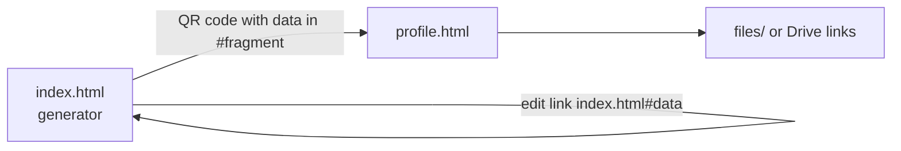

# QR Profile Generator

A static web page that makes a QR code for a contact profile.
The profile shows a name, contact details, and design files (PDF and images).
It runs on GitHub Pages and needs no server. It saves no data.

## How it works



A QR code cannot hold files. So the QR code opens `profile.html`, and that page links to the files.
All profile data is in the fragment of the QR link (`profile.html#...`).
The browser does not send the fragment to the server, and the site stores nothing.

The generator gives two QR code types:

1. **Profile page.** The QR code holds all the data. A change needs a new QR code.
2. **Contact card only.** The QR code holds a vCard. The phone saves the contact. No files.

To edit a profile later, keep the **edit link** from the generator. It fills the form again. Then download the new QR code.

## Publish on GitHub Pages

The repository is `Nabila-Farzana/QrFolio`, and it must stay public. GitHub Pages needs a paid plan for a private repository.

1. In this folder, set the personal git identity for this repository only, then push:

   ```sh
   git init -b main
   git config user.name "Nabila Farzana"
   git config user.email "nabila.ruet12@gmail.com"
   git config user.email          # must print the personal email
   git add .
   git commit -m "Add QrFolio QR profile generator"
   git remote add origin https://github.com/Nabila-Farzana/QrFolio.git
   gh auth switch --user Nabila-Farzana
   git push -u origin main
   ```

   The remote uses HTTPS, because the SSH key on this machine belongs to the work account.

2. On GitHub, open **Settings > Pages**. Set **Source** to `Deploy from a branch`, branch `main`, folder `/ (root)`.
3. After about one minute, open `https://nabila-farzana.github.io/QrFolio/`.

## Design files

A person adds files in one of three ways. All three are optional.

1. **Choose from Google Drive.** The person logs in, then selects or uploads files. The page asks before it shares the files with "Anyone with the link".
2. **Choose from Dropbox.** The person selects files. Dropbox makes a share link for each file.
3. **Add link.** The person pastes any share link.

The files stay in the person's own account. The site stores nothing.
The page loads the Google or Dropbox scripts only after a click on that button.

A button shows only when its keys are in `assets/js/config.js`. The keys are public by design, so you can commit them.

### Set up the Dropbox button

1. Open the [Dropbox App Console](https://www.dropbox.com/developers/apps) and create an app (Scoped access, App folder).
2. In **Settings > Chooser / Saver / Embedder domains**, add `nabila-farzana.github.io` and `localhost`.
3. Copy the **App key** into `dropboxAppKey` in `config.js`.

### Set up the Google Drive button

1. In the [Google Cloud console](https://console.cloud.google.com/), create a project.
2. Enable the **Google Picker API** and the **Google Drive API**.
3. Set up the **OAuth consent screen**: user type External, and the scope `.../auth/drive.file`. Publish the app, or only test users can log in.
4. Create an **OAuth client ID** of type Web application. Add these JavaScript origins: `https://nabila-farzana.github.io` and `http://localhost:8000`.
5. Create an **API key**. Restrict it to the Google Picker API and to the same two sites.
6. Put the API key, the client ID, and the **project number** (as `appId`) in `config.js`.

The `drive.file` scope lets the site use only the files that the person selects or uploads.

This repository hosts no design files, by design. The code accepts only a full `https` link to another site, and `.gitignore` blocks a local `files/` folder. So private work cannot reach this public repository by mistake.

## Notes

- Make the QR code on the GitHub Pages address, not from a local file. The QR code holds the page address.
- Test the QR code with a phone before you print it.
- All data on the site is public. Do not add private information.
- `assets/vendor/qrcode.min.js` is [qrcode-generator](https://github.com/kazuhikoarase/qrcode-generator) 1.4.4 by Kazuhiko Arase. Its license is in `assets/vendor/LICENSE-qrcode-generator.txt`.

## License

MIT. See `LICENSE`.
- To test on your computer, run `python3 -m http.server` in this folder and open `http://localhost:8000`.
